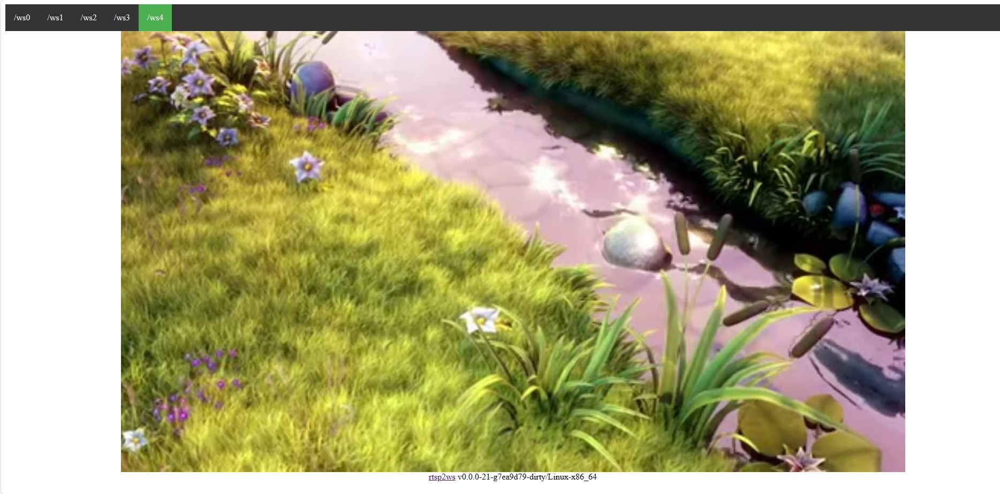

*** Notice *** Live demo are stopped till I migrate to a european web hosting.

# rtsp2web

This is a simple application that connect to RTSP streams, send compressed data over websocket and then decode on browser side using [webcodec](https://github.com/w3c/webcodecs)

[Live Demo](https://rtsp2web.agreeabletree-365b9a90.canadacentral.azurecontainerapps.io)

Build
------- 
	cmake . && make

Usage
------- 
    ./rtsp2ws [OPTION...] <rtspurl> ... <rtspurl>

    -h, --help            Print usage
    -v, --verbose arg     Verbose (default: 0)
    -P, --port arg        Listening port (default: 8080)
    -N, --thread arg      Server number threads (default: "")
    -p, --path arg        Server root path (default: html)
    -c, --sslkeycert arg  Path to private key and certificate for HTTPS (default: "keycert.pem")
    -C, --config arg      Config
    -r, --rtptransport arg  RTP transport(udp,tcp,multicast,http) (default:
                          tcp)

Using Docker image
===============
You can start the application using the docker image :

        docker run -p 8080:8080 ghcr.io/mpromonet/rtsp2web

The container entry point is the application, then you can :

* get the help using :

        docker run ghcr.io/mpromonet/rtsp2web -h

* run the container specifying parameters :

        docker run -p 8080:8080 ghcr.io/mpromonet/rtsp2web rtsp://37.157.51.30/axis-media/media.amp rtsp://71.83.5.156/axis-media/media.amp rtsp://86.44.41.160/axis-media/media.amp 
        docker run -p 8080:8080 -v $PWD/keycert.pem:/tmp/keycert.pem ghcr.io/mpromonet/rtsp2web -c /tmp/keycert.pem rtsp://37.157.51.30/axis-media/media.amp rtsp://71.83.5.156/axis-media/media.amp

